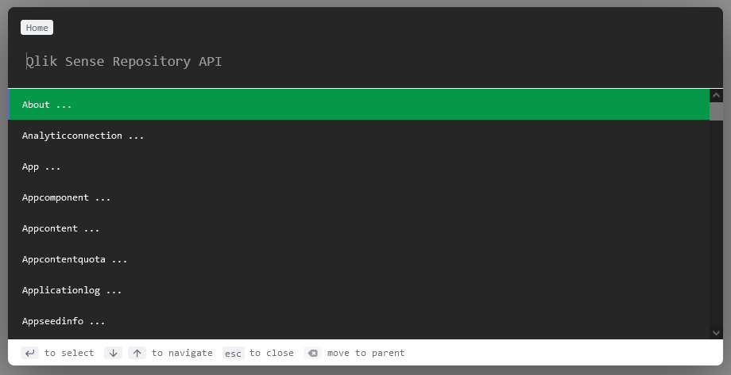
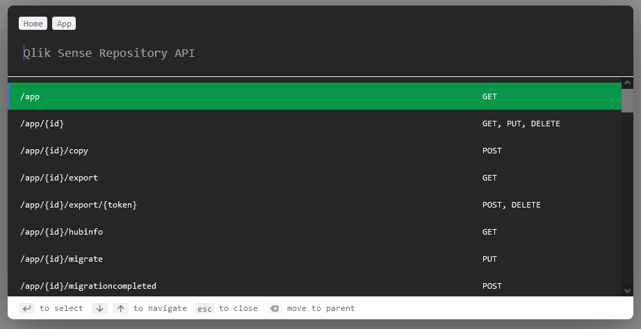
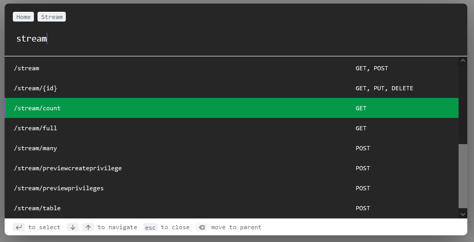
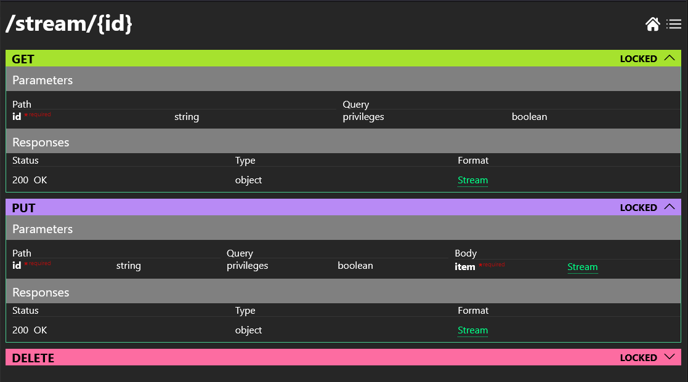
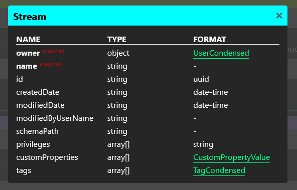
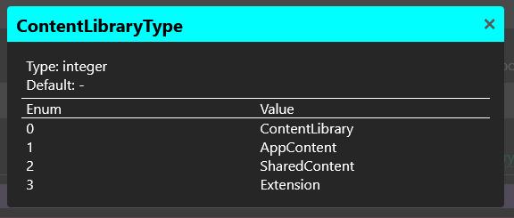

# Qlik Sense Enterprise (QSEoW) Repository Rest API Browser

Different presentation of the official [Qlik Sense Repository API](https://help.qlik.com/en-US/sense-developer/February2022/APIs/RepositoryServiceAPI/index.html) documentation.

Command palette helps navigating though the methods

View all endpoints for method

Search

All methods for endpoint

Data definition

Enum

